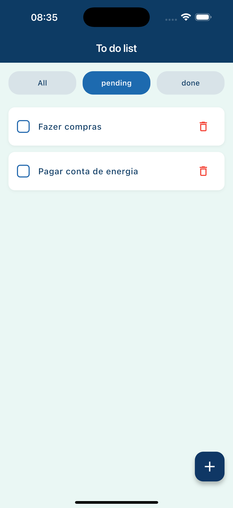
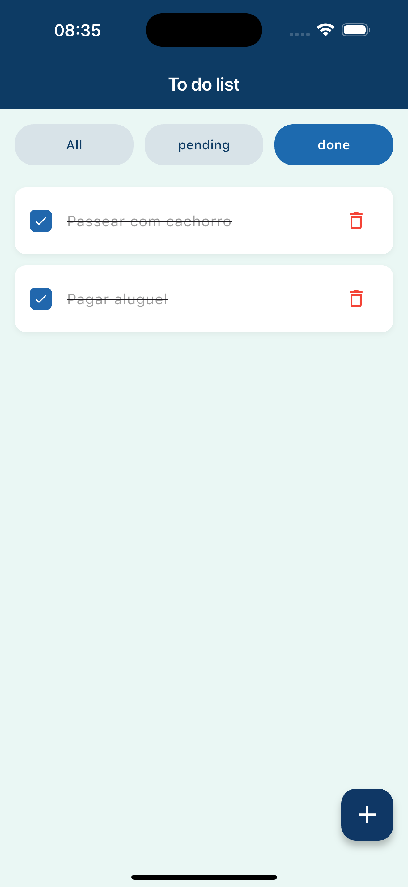
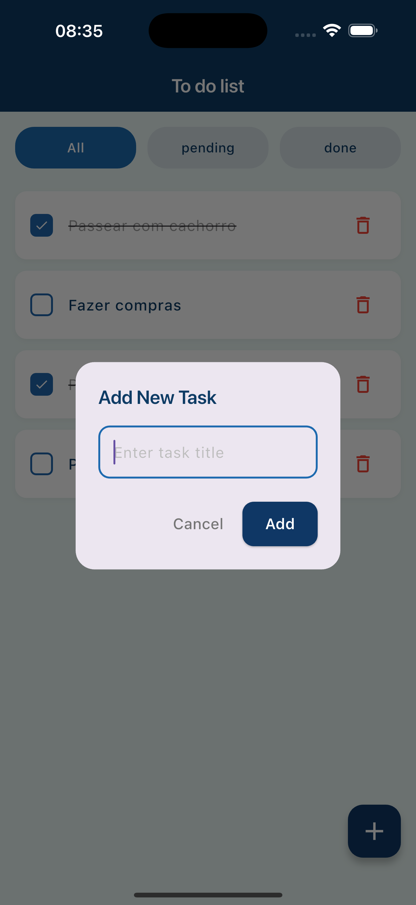

# To-Do List App - Flutter

Aplicativo de lista de tarefas desenvolvido em Flutter seguindo os princípios de **Clean Architecture**, **SOLID** e utilizando **BLoC** para gerenciamento de estado.

## 📱 Screenshots

<div align="center">
  
  
  
  
</div>

## 🏗️ Estrutura da Arquitetura

O projeto segue a **Clean Architecture** organizada por features com 3 camadas principais:

```
lib/
├── 📂 core/                          
│   ├── di/
│   │   └── injection_container.dart  
│   ├── errors/
│   │   └── failures.dart             
│   └── usecases/
│       └── usecase.dart             
│
└── 📂 features/
    └── tasks/                        
        │
        ├── 📂 domain/                
        │   ├── entities/
        │   │   └── task.dart         
        │   ├── repositories/
        │   │   └── task_repository.dart          
        │   └── usecases/
        │       ├── get_tasks.dart    
        │       ├── add_task.dart     
        │       ├── delete_task.dart  
        │       └── toggle_task.dart  
        │
        ├── 📂 data/                  
        │   ├── models/
        │   │   └── task_model.dart   
        │   ├── datasources/
        │   │   └── task_local_datasource.dart    
        │   └── repositories/
        │       └── task_repository_impl.dart     
        │
        └── 📂 presentation/          
            ├── bloc/
            │   ├── task_bloc.dart    
            │   ├── task_event.dart   
            │   └── task_state.dart   
            ├── pages/
            │   └── tasks_page.dart   
            └── widgets/
                ├── add_task_button.dart     
                ├── add_task_dialog.dart      
                ├── filter_tabs.dart          
                ├── task_item.dart            
                └── task_list.dart            

test/
└── features/
    └── tasks/
        ├── domain/usecases/          
        ├── data/repositories/        
        └── presentation/bloc/        
```
## 🚀 Como Rodar o Projeto

### 1️⃣ Clonar o Repositório

```bash
git clone https://github.com/WelvisSS/to_do_list.git
cd to_do_list
```

### 2️⃣ Instalar Dependências

```bash
flutter pub get
```

### 3️⃣ Gerar Código de Mocks (para testes)

```bash
dart run build_runner build --delete-conflicting-outputs
```

### 4️⃣ Executar o Aplicativo

**Em um dispositivo/emulador conectado:**
```bash
flutter run
```

## 🧪 Como Rodar os Testes

### Executar Todos os Testes

```bash
flutter test
```